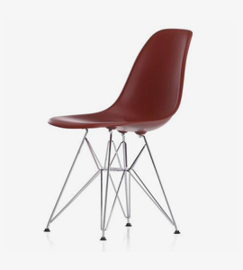

# Assets

A curated collection of media assets — images, videos, audio, and documents — organized for reuse across web projects.

## Directory Structure

```
audios/    Audio files (MP3, OGG, WAV) — sound effects, music, note samples
dcos/      Documents (PDF, DOCX, XLSX) — books, guides, spreadsheets
images/    Images organized by use case:
  ├── favicon/              Favicon and app icon PNGs
  ├── gif/                  Animated GIFs
  ├── human-avatar/         Person/avatar photos, testimonials
  ├── large-photo/          High-resolution photos
  ├── mid-photo/            Medium-resolution photos
  ├── parallax-background/  Parallax section backgrounds
  ├── png/                  Miscellaneous PNG graphics & patterns
  ├── product-photo/        Product images
  ├── slides-photo/         Slideshow images
  ├── small-photo/          Small/responsive photos, galleries
  ├── svg/                  SVG vector graphics
  └── thumbnail-photo/      Thumbnails — blog posts, galleries, products
videos/    Video files (MP4) — short clips, social media content
```

## File Types

| Type     | Formats                          |
| -------- | -------------------------------- |
| Images   | JPEG, PNG, GIF, SVG              |
| Videos   | MP4                              |
| Audio    | MP3, OGG, WAV                    |
| Docs     | PDF, DOCX, XLSX                  |

## Usage

Reference assets by their relative path:

```html

<video src="videos/funny.mp4" controls></video>
<audio src="audios/sample-2.ogg" controls></audio>
```
